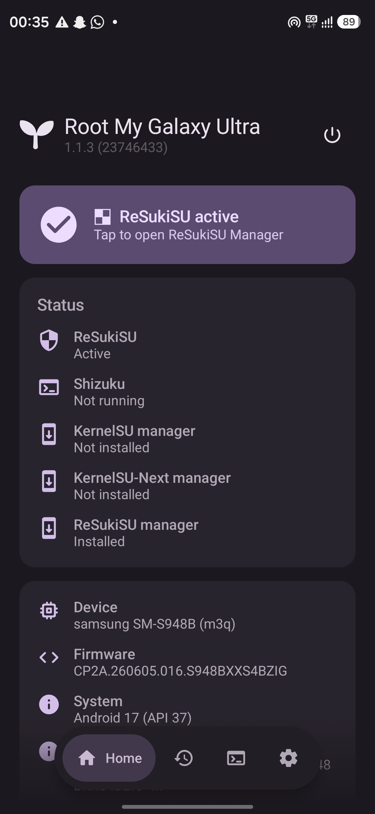
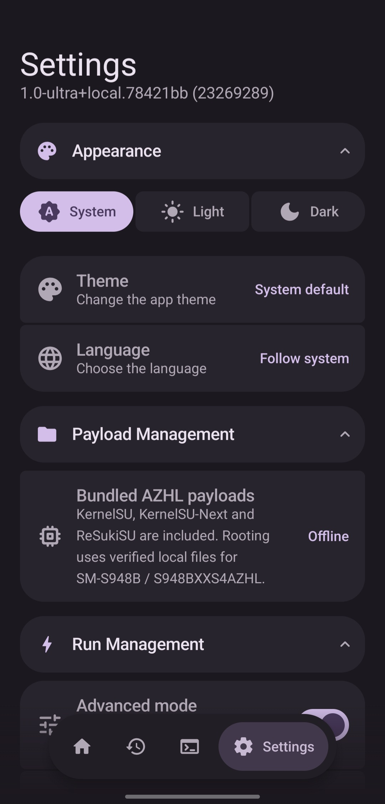

# Root My Galaxy Ultra

Temporary root for **Samsung Galaxy S26 Ultra (m3q) regional and carrier variants**, with a choice
of **KernelSU**, **KernelSU-Next** or **BakaSU (former ReSukiSU)**. Root is lost after a full
reboot; activate it again through the app.

[Download the latest release](https://github.com/xorpix/Root-My-Galaxy-Ultra/releases/latest)
· [Release notes](https://github.com/xorpix/Root-My-Galaxy-Ultra/releases)
· [Report an issue](https://github.com/xorpix/Root-My-Galaxy-Ultra/issues)

> Experimental software: a root attempt can freeze or reboot the phone.
> Begin from a full reboot and reboot again after a failed or uncertain attempt.
> Keep a backup of important data.

## Device and kernel support

The app recognizes regional `SM-S948` models, including dual-SIM names, and the
Japanese carrier models `SC-53G` and `SCG37`. All routes require **m3q**,
`arm64-v8a`, an `aarch64` kernel and **4 KB pages**.

| Model / build | Kernel requirement | Root method | Shizuku required for rooting |
|---|---|---|---|
| SM-S948B / `S948BXXS4AZHL`, Android 16 / API 36 | Exact recorded AZHL kernel | M3Q / GhostLock | Yes, running as shell through wireless debugging |
| S26 Ultra regional and carrier variants, Android API 36 or newer | `android16` / Linux `6.12` GKI family | DirtyFrag (experimental family support) | No |

DirtyFrag selects the shared helper and matched backend payloads by kernel family.
It automatically creates profiles containing the phone's actual model, firmware,
full kernel release, SDK, ABI and page size; a firmware whitelist is not required.
The recorded BZIG and Canadian BZID entries keep their existing profile IDs.

**Recognition is not a hardware-test result.** Patched firmware can block
DirtyFrag, and a compatible kernel family does not by itself verify Samsung
backend loading. Other kernel families and 16 KB pages need matching native
payloads before they can be enabled. See the
[S26 Ultra support rules and validation](docs/S26-ULTRA-SUPPORT.md).
Recorded identities and artifact checksums are in the
[AZHL catalog](app/src/main/assets/azhl/catalog.json) and
[DirtyFrag catalog](app/src/main/assets/df/catalog.json).

## Getting started

1. Install the APK from this repository's releases and open it.
2. Check the model and kernel shown on Home against the support requirements above.
3. Choose a backend under **Settings → Root Management → KernelSU flavour**.
4. Follow the instructions for your firmware below.
5. Open the matching manager and confirm it reports the backend as working.
   Grant **Root My Galaxy Ultra** superuser access when requested so its
   post-root and recovery actions can run.

### AZHL — M3Q / GhostLock

Start from a full reboot. Start Shizuku using **wireless debugging**, then grant
Root My Galaxy Ultra permission to use it. This path needs Shizuku running as
the Android shell user, not a root-started Shizuku service.

Start the root run from Home. The app waits until at least **three minutes
after boot** before launching the payload; a longer configured settle time
still applies. It prevents another app-level M3Q launch in the same boot.
After a failure, perform a full reboot before trying again.

### S26 Ultra variants — DirtyFrag

Start from a full reboot, choose the backend and start the root run from Home.
**Shizuku and wireless debugging are not needed for this root method**, and
the AZHL three-minute settle requirement does not apply.

Wait for the result, then confirm the backend is working in its manager.
A failure or timeout needs a full reboot before another attempt.

## Backends and manager apps

The current source bundles these driver/daemon pairs:

| Backend | Driver / UAPI | Verified UAPI 5 manager downloads |
|---|---|---|
| KernelSU | `32665 / 5` | [Manager APK (ZIP)](https://nightly.link/tiann/KernelSU/actions/runs/37518122292/manager.zip) · [Official build](https://github.com/tiann/KernelSU/actions/runs/37518122292) |
| KernelSU-Next | `33323 / 5` | [Manager APK (ZIP)](https://nightly.link/KernelSU-Next/KernelSU-Next/actions/runs/37513294225/manager.zip) · [Official build](https://github.com/KernelSU-Next/KernelSU-Next/actions/runs/37513294225) |
| BakaSU | `35216 / 5` | [Manager APKs (ZIP)](https://nightly.link/Baka-SU/BakaSU/actions/runs/37544361704/Manager-release.zip) · [Official build](https://github.com/Baka-SU/BakaSU/actions/runs/37544361704) |

Download the ZIP, extract it, and install the APK. For BakaSU on a Samsung phone,
choose `BakaSU_v4.2.0-rc3_35216-arm64-v8a-release.apk` from the archive.
These are official upstream development builds verified to use UAPI 5.
The download links use [nightly.link](https://nightly.link/)
to retrieve the original GitHub artifacts without a GitHub login; **Official build**
opens their upstream source and artifact records. The pinned artifacts are
currently retained until **4 January 2027**.

These are pinned upstream development revisions with Samsung compatibility
changes. [Backend documentation](backends/README.md) contains the exact source
revisions, checksums, build instructions and validation limits.

The app's manager controls open official GitHub downloads, including a selected
release through **Manager version control**. Complete the download and Android
installation prompts yourself. Manager APKs are separate from the bundled root
payloads.

**These pairs require a manager built for UAPI 5.** A release tag such as
`v4.2.0-rc3` or `v3.4.0` alone does not establish compatibility; check the UAPI
number shown by the manager. The existing release picker may still offer a
manager with an older UAPI. Use the verified UAPI 5 manager downloads in the
table above for these development snapshots.

- **Use one backend per boot.** Fully reboot before activating a different one.
  Switching backends may disable existing modules; re-enable compatible modules
  in the selected manager afterwards.
- **A manager update does not replace the loaded driver.** A newer manager build
  number alone does not mean the driver is broken.
- To use a driver included in a newer Root My Galaxy Ultra APK, update the app,
  fully reboot, then activate root again. Matching UAPI numbers alone do not
  guarantee every manager or module feature works.

## Payloads, settings and recovery

The supported root payloads and backend daemons are **included in the APK**.
Rooting does not download them from a remote feed. “Included” or “Offline” refers
to these local files; it does not mean the phone has lost its internet connection.
Downloading app or manager updates still needs internet access.

Useful controls in Settings:

| Setting | Purpose |
|---|---|
| Disable KSU modules | Start with modules disabled when investigating a module problem. |
| Reset all root state before loading | Destructive recovery option. AZHL clears the contents of `/data/adb`; DirtyFrag clears installed and pending modules. Leave it off for normal rooting. |
| Protect image partitions | Enabled by default. Requests read-only protection for image partitions after root; it can block image flashing and boot-patching operations. |
| Recovery Management | Module reload and framework/reboot actions for an already rooted session. A framework restart does not replace the full reboot required for a fresh attempt or backend change. |
| Root on boot | Optional automation. Establish a working manual setup first; Android background-service restrictions and transport availability can prevent automatic startup. |

The **Shizuku start token** is optional and only applies to Shizuku builds that
support authenticated start requests. It must be the actual token from that
Shizuku build. Leave it unset for ordinary manual startup or when you do not use
that feature.

## Troubleshooting

| Symptom | What to check |
|---|---|
| Unsupported device or kernel | Check the S26 Ultra model/codename, kernel family, ABI and page size. AZHL/GhostLock still requires its exact recorded build. |
| Failed attempt, freeze or reboot | Fully reboot before trying again. Keep the failed run log; repeated retries in one boot are not a recovery method. |
| Root works, but a module does not | Check the module's requirements and its manager logs. Successful root does not confirm that every module or injection framework has initialized. |
| Manager works, but this app's root actions fail | Grant this app superuser permission in the selected manager. |
| “Invalid auth token” from Shizuku | Delete the saved start token if unused, or replace it with the token supplied by your Shizuku build. |
| Root disappears after reboot | Expected: this is temporary root. Run the app again using the setup for your firmware. |

For a bug report, export the affected run from **History** and include the app
version/build code, firmware, selected backend, last successful stage and whether
the phone froze or rebooted. **Logs** contains the app's general diagnostic log.
Review exported logs for personal information before posting them publicly.

## Automatic backend updates

The [weekly build workflow](tools/backend-refresh/README.md) checks official KernelSU,
KernelSU-Next and BakaSU commits every Monday at 03:17 UTC. When sources change,
it builds matched drivers/daemons, runs validation, signs the APK with the existing
release key and publishes the next patch release. Unchanged weeks are skipped.
Keep the build kit and `backends/` provenance records in git; the linked guide
covers signing secrets, manual runs and failure recovery.

## Build from source

Use the repository root — the directory containing `gradlew.bat` and
`settings.gradle.kts`. Bundled backend binaries are already present; an ordinary
APK build does not require rebuilding the drivers.

Requirements:

- JDK 21 or 25 to launch Gradle. The checked-in
  [daemon configuration](gradle/gradle-daemon-jvm.properties) selects **JDK 25**
  and provides download URLs; Java/Kotlin compilation targets **21**.
  Gradle can provision the daemon JDK if it is not installed
  ([Gradle documentation](https://docs.gradle.org/current/userguide/gradle_daemon.html#sec:daemon_jvm_criteria)).
- Android SDK Platform **37** (`platforms;android-37.0`), Build Tools **36.0.0**,
  NDK **28.2.13676358** and CMake **3.22.1**.
- The included Gradle wrapper. Internet access is needed for initial toolchain
  and dependency downloads.

### Windows / PowerShell

Clone the project if you do not already have a checkout:

```powershell
git clone https://github.com/xorpix/Root-My-Galaxy-Ultra.git
cd Root-My-Galaxy-Ultra
```

Create `local.properties` in that directory and set your actual SDK path.
Use forward slashes on Windows:

```properties
sdk.dir=C:/Users/YOUR_USER/AppData/Local/Android/Sdk
```

Then build:

```powershell
.\gradlew.bat :app:assembleDebug
```

### Linux / macOS

Set `sdk.dir` in `local.properties` to your SDK's absolute path, or set
`ANDROID_HOME`, then run:

```sh
sh ./gradlew :app:assembleDebug
```

The debug APK is written to `app/build/outputs/apk/debug/app-debug.apk`.
The build configuration is in [app/build.gradle.kts](app/build.gradle.kts).
Do not commit `local.properties` or signing secrets.

### Release signing

Release builds require a signing key. Set `KEYSTORE_FILE`, `KEYSTORE_PASSWORD`,
`KEY_ALIAS` and `KEY_PASSWORD` in the environment, or create the ignored file
`keystore/keystore.properties`:

```properties
storeFile=keystore/release.p12
storeType=PKCS12
storePassword=YOUR_STORE_PASSWORD
keyAlias=YOUR_KEY_ALIAS
keyPassword=YOUR_KEY_PASSWORD
```

Build with `:app:assembleRelease` instead of `:app:assembleDebug`.
Debug builds use the configured release key when present, otherwise the local
Android debug key. Installing over an existing APK requires the same signing key.

## Screenshots

AZHL screenshots from an earlier build; labels may differ in current releases.




## Credits and source notes

- [BuSung-dev / Root My Galaxy](https://github.com/BuSung-dev/Root-My-Galaxy)
  — original application.
- [rushiranpise / Root My Galaxy Next](https://github.com/rushiranpise/Root-My-Galaxy-Next)
  — upstream fork and application foundation.
- **M3Q Root / @bklyn_syed** — M3Q payload used for AZHL. The bundled payload is a
  prebuilt binary; the reference code under `native/azhl` is not a complete source
  reproduction of it. See [AZHL provenance](native/azhl/ORIGIN.md),
  [third-party notices](native/azhl/NOTICE) and
  [helper variant metadata](app/src/main/assets/m3q/helper-variants.json).
- [diabl0w / DFRoot](https://github.com/diabl0w/DFRoot) — DirtyFrag integration
  for eligible S26 Ultra variants. See [DirtyFrag provenance and licensing notes](app/src/main/cpp/dirtyfrag/DF_ORIGIN.md).
- **KernelSU, KernelSU-Next and BakaSU contributors** — root backends;
  [source revisions and Samsung patches](backends/README.md).

The application repository carries the [Apache 2.0 license](LICENSE).
Third-party components retain their own terms; consult the linked provenance and
notice files, including the separate licensing status documented for DirtyFrag.
